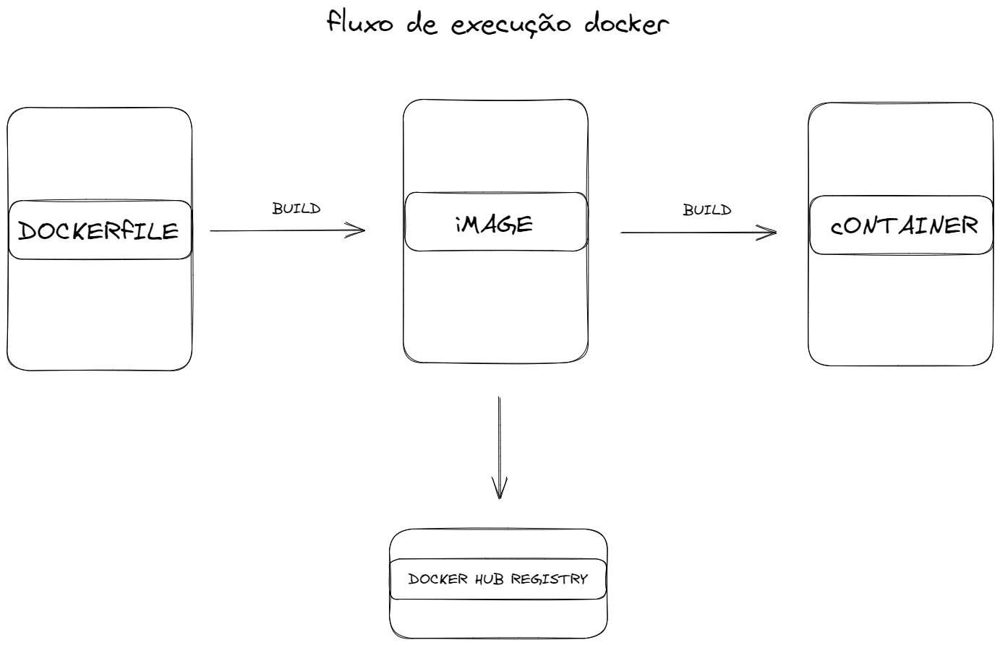

# Docker
Repositório dedicado para os meus estudos sobre docker 🐳

🚧 - EM Construção

### O que é o docker?

O Docker é uma plataforma para o desenvolvedor e/ou administrador de sistemas: criar, executar e compartilhar aplicativos em containers.
O uso de containers para implantar aplicativos é chamado de conteinerização.

O docker foi feito para rodar no Linux. Logo, o melhor comportamento você encontrará rodando no Linux, apesar de poder instalar e usar tanto em Windows quanto em macOS.

O container é:

- [x] Flexível: Até as aplicações mais complexas podem ser containers.
- [x] Leve: os containers aproveitam e compartilham o kernel do host, tornando-os muito mais eficientes em termos de recursos do sistema do que as máquinas virtuais.
- [x] Portátil: você pode criar localmente, implantar na nuvem e executar em qualquer lugar.
- [x] Acoplamento fraco: os containers são altamente auto-suficientes e encapsulados, permitindo substituir ou atualizar um sem atrapalhar outros.
- [x] Escalável: você pode aumentar e distribuir automaticamente réplicas de containers.
- [x] Seguro: os containers aplicam restrições e isolamentos agressivos aos processos sem nenhuma configuração necessária da parte do usuário.

  

